# CoRL Supplementary Video Submission Guide: Verify2Act (V2A)

This document provides a complete storyboard, narrative script, and concrete instructions for generating the video assets required for your **CoRL Supplementary Video Submission**. Since the paper is submitted, this video should clearly and professionally convey your core contributions, qualitative advantages over state-of-the-art baselines, and execution traces on both **Cluttered Nut Assembly (RoboSuite)** and **CALVIN**.

---

## 🎥 Video Outline & Storyboard (210 Seconds / ~3.5 min)

A high-impact robotics video should hook the viewer in the first 15 seconds, explain the system architecture clearly, show qualitative comparison splits, and present diverse task successes.

```mermaid
gantt
    title CoRL Video Storyboard Timeline (210s)
    dateFormat  X
    axisFormat %ss
    section Video Segments
    1. Hook & Motivation (0-20s)              :active, 0, 20
    2. V2A System Architecture (20-55s)       : 20, 55
    3. Qualitative Feature Rollout (55-100s)  : 55, 100
    4. Cluttered Nut Assembly (100-150s)      : 100, 150
    5. CALVIN Long-Horizon Tasks (150-195s)   : 150, 195
    6. Conclusion & Summary (195-210s)        : 195, 210
```



### Segment 1: Hook & The "Pixel Bottleneck" Problem (0–20s)

> [!NOTE]
> **Simulation vs. Real Robot:** V2A is evaluated on simulated environments (RoboSuite Nut Assembly + CALVIN), so the video should use **simulation demos** — there is no real robot footage to include. This is completely standard for CoRL submissions. If you later run real-robot transfer experiments, that footage can replace or supplement the simulation clips. For now, high-quality simulation recordings are the right call.

*   **Visuals:** Side-by-side split screen showing:
    1.  **Left:** Your RoboSuite or CALVIN simulation scene.
    2.  **Right:** Blurry or background-erased frames from pixel-level Diffusion-WM rollouts, where pegs disappear and grips vanish.
*   **Narrative (Text Overlay / Voiceover):** *"Standard visual planning loops for robots rely on pixel-level generative world models, which are slow and prone to compounding hallucinations—often erasing backgrounds or causing objects to ghost. We present Verify2Act (V2A), a neuro-symbolic framework that decouples semantic reasoning from physical simulation entirely in a visual feature space."*

### Segment 2: V2A System Architecture & The Three Stages (20–55s)
*   **Visuals:** Animated block diagram highlighting the three-stage loop:
    1.  **Stage 1: Propose (VLM Planner):** The VLM (GPT-4o) observes the scene and proposes $K$ high-level action sequences.
    2.  **Stage 2: Imagine (Latent RLA-Flow WM):** The specialized Flow-Matching dynamics model rolls out future states in DINOv2 latent space, conditioned on **Temporal History Context** and **CLIP Cross-Attention Action Grounding**.
    3.  **Stage 3: Verify (Dual-Head Critic):** The contrastive critic evaluates rollouts for Temporal Consistency and Goal Proximity. If rejected, it feeds natural language and visual analysis back to the VLM to **Reflect** and replan. If accepted, the robot executes the action (**Act**).

> [!TIP]
> A pre-generated static architecture diagram is available. Use it as a title card or hold frame for the voiceover. For the polished version, animate the three stage boxes one at a time with simple slide transitions in your video editor.

### Segment 3: Qualitative Feature Rollout Comparison (55–100s)
*   **Visuals:** A **3-column** split comparing multi-step autoregressive rollouts reconstructed back to RGB using the Feature Decoder:
    *   **Left:** Ground Truth.
    *   **Center:** **V2A-WM (Ours)** — sharp, consistent gripper and block positions, perfect background preservation.
    *   **Right:** **Diffusion-WM** — showing peg disappearance, color changes, and slow rendering.
*   **Narrative:** *"By operating in a low-dimensional Residual Latent Action space, V2A predicts long-horizon physics accurately and without hallucinations. Reconstructing these latents shows V2A maintains sharp, physically grounded details, whereas pixel diffusion erases backgrounds and hallucinates object positions."*
*   **Polish:** Zoom in on a static portion of the table surface. Highlight that V2A-WM keeps it perfectly anchor-steady (DINO residuals + Sparsity Regularization), while diffusion shifts the wood texture.

### Segment 4: Cluttered Nut Assembly (RoboSuite) (100–150s)
*   **Visuals:** Show the robot executing nut assembly under extreme clutter.
    *   **Dynamic Obstacle Clearance:** Highlight the robot picking up blocking obstacle nuts, moving them out of the way, and then assembling the target nut.
    *   **Failure & Reflection Trace:** Show a clip where the VLM proposes a blocked path, the World Model predicts a collision/failure, the Critic triggers a **REJECT & REFLECT** event, the VLM updates the plan, and the robot successfully executes the corrected sequence.
    *   **Metrics Overlay (on-screen card):**

| Method | Nut Assembly SR |
|---|---|
| No WM (VLM-Only) | 0.17 |
| RLA-WM | 0.43 |
| Diffusion-WM | 0.55 |
| **V2A-WM (Ours)** | **0.58** |

### Segment 5: CALVIN Multi-Step Manipulation (150–195s)
*   **Visuals:** Fast-forwarded long-horizon sequences (completing 5 subtasks in a row):
    *   Subtask 1: *Open drawer*
    *   Subtask 2: *Pick red block*
    *   Subtask 3: *Place red block in drawer*
    *   Subtask 4: *Close drawer*
    *   Subtask 5: *Turn on lightbulb*
*   **Highlight:** Temporal consistency of the gripper and drawer handles inside the world model over large steps without drifting.
*   **Metrics Overlay:** Show the SR₁–SR₅ progression table to demonstrate consistent performance across increasing horizon lengths.

| Method | SR₁ | SR₂ | SR₃ | SR₄ | SR₅ |
|---|---|---|---|---|---|
| No WM (VLM-Only) | — | — | — | — | 0.70 |
| RLA-WM | — | — | — | — | 0.69 |
| Diffusion-WM | — | — | — | — | 0.66 |
| **V2A-WM (Ours)** | — | — | — | — | **0.76** |

> [!TIP]
> Fill in SR₁–SR₄ from your `eval_summary.json` chain results if available. The SR₁→SR₅ progression curve is a great standalone figure for this segment — it shows V2A's advantage compounding over longer horizons.

*   **Efficiency Callout:** *"V2A-WM achieves this with only 15 reflective VLM calls vs. 444 for Diffusion-WM — a **30× efficiency gain**."*

### Segment 6: Outro (195–210s)
*   **Visuals:** Title card with project title, logo, and links (Paper, Project Page, GitHub).

---

## 🛠️ How to Generate the Visual Assets

You have two powerful visualization utilities in your codebase that will compile the exact frames you need for Segments 3, 4, and 5.

### 1. Generating Side-by-Side Model Comparisons (Segment 3)
Your repository includes the script `verify2act/pipeline/compare_imaginations.py`, which generates a **3-column split** (Ground Truth | V2A-WM | Diffusion-WM).

To run this comparison on the **Nut Assembly** task:

```bash
xvfb-run -a python verify2act/pipeline/compare_imaginations.py \
  --v2a-ckpt verify2act/output/v2a_wm/nut_assembly/wm_history_1_sparsity_01/ckpt/latent_dynamics_best.pt \
  --v2a-encoder-ckpt verify2act/output/v2a_wm/nut_assembly/encoder/ckpt/delta_encoder_best.pt \
  --rla-ckpt verify2act/output/rla_wm/nut_assembly/wm/ckpt/latent_dynamics_best.pt \
  --decoder-dir verify2act/output/v2a_wm/nut_assembly/decoder \
  --diffusion-adapter verify2act/output/diffusion_wm/nut_assembly/wm/best/unet_lora \
  --diffusion-decoder verify2act/output/diffusion_wm/nut_assembly/decoder/checkpoint-5000 \
  --dataset-dir robosuite/data_capture/dataset/nut_assembly_merged \
  --output-dir verify2act/output/comparison_visuals \
  --num-samples 5 \
  --horizon 10 \
  --device cuda
```

*This will output clean, ordered sequences of frames for each method under `verify2act/output/comparison_visuals/{method_name}/` which you can immediately compile into a split-screen video.*

### 2. Visualizing V2A World Model Predictions (Segments 4 & 5)
To visualize how the V2A World Model transforms noisy latents into crisp, reconstructed images on **CALVIN**:

```bash
python verify2act/latent_wm/visualize_wm.py \
  --dataset-type calvin \
  --dataset-dir calvin/dataset/task_ABC_D_filtered/training \
  --wm-ckpt verify2act/output/v2a_wm/calvin/wm/ckpt/latent_dynamics_best.pt \
  --encoder-ckpt verify2act/output/v2a_wm/calvin/encoder/ckpt/delta_encoder_best.pt \
  --decoder-ckpt verify2act/output/v2a_wm/calvin/decoder/latent_decoder_best.pt \
  --history-len 1 \
  --num-samples 10 \
  --output-dir verify2act/output/visualizations
```

*This script generates composite grids showing: `[Current State] [Decoded Ground Truth] [Decoded V2A Predicted Future] [GT Target Image]`. This is perfect for proving that your latent rollouts align perfectly with physical reality.*

---

## 🎨 Design & Polish Recommendations

To ensure your supplementary video matches the premium standards expected of top-tier roboticists at CoRL, adhere to these guidelines:

1.  **Color-Code the Critic Decisions:**
    *   When showing a **Rejection / Reflection** event, overlay the clip with a semi-transparent **red border** or a distinct red `[REJECTED: Temporal Inconsistency (Head 2)]` graphic.
    *   When showing an **Acceptance**, overlay a **green border** or a green `[ACCEPTED: Proceed to Execution]` graphic.
2.  **Highlight Cross-Attention Grounding:**
    *   During Stage 2 animations or text overlays, show the text action (e.g., `"pick round nut"`) with colored tokens that physically link to active bounding boxes or attention heatmaps on the DINO patch grid. This highlights your novel **Cross-Attention Action Grounding** contribution.
3.  **Preserve the Background:**
    *   Zoom in on a static part of the table during V2A-WM rollouts vs. pixel diffusion rollouts. Highlight how pixel diffusion erases or shifts the wood textures of the table, while V2A-WM (due to its DINO residuals and **Sparsity Regularization**) keeps it completely anchor-steady.
4.  **Architecture Diagram:**
    *   A pre-generated static diagram is saved at `v2a_architecture_diagram.png` in the project root. Use it as a full-screen hold frame during Segment 2 while the voiceover plays. If animating, reveal each of the three stage boxes sequentially with a 0.3–0.5s fade-in or slide-in transition.
5.  **Compiling Frames to Video:**
    You can easily convert the generated image sequences into premium `.mp4` videos using `ffmpeg`:
    ```bash
    ffmpeg -framerate 10 -i verify2act/output/comparison_visuals/v2a_wm/ep_001_step%02d.png -c:v libx264 -pix_fmt yuv420p v2a_imagination_rollout.mp4
    ```

---

> [!TIP]
> **Recommended Next Step:**
> Run the `compare_imaginations.py` script above (3-column: GT | V2A-WM | Diffusion-WM) for a few episodes. The visual difference between your model's sharp predictions and diffusion's ghosting/blurring is your strongest selling point, and seeing it early will help you decide which clips to put in the final cut.

---

## 🤖 Real Robot Demo (Scripted Production Approach)

The real robot demo will be **fully scripted and produced offline** — no live inference required. The robot physically executes pre-planned motions, while all VLM plans, world model imaginations, and critic decisions are pre-computed and overlaid in post-production. This is a standard and credible approach for supplementary videos when the primary contribution is the planning framework, not the low-level controller.

> [!IMPORTANT]
> **Implementation Location:** All scripted demo logic (motion plans, WM inference, critic overlays) lives in your **separate ROS project**, not in this repository. This section documents the production plan so you can implement it there.

---

### Production Pipeline Overview

```
Robot Execution (ROS)          Offline WM Inference          Video Post-Production
──────────────────────         ─────────────────────         ─────────────────────
1. Record raw robot footage  → 2. Run frames through WM   → 3. Composite overlay:
   (pre-planned motions)          (visualize_wm.py)              - Scripted VLM plan text
                                  Output: imagination grids       - WM imagination panel
                                                                  - Critic verdict card
                                                                  - Color-coded borders
```

---

### Task 1: Blocked Target + Obstacle Clearance *(Primary Demo)*

This task is designed to naturally showcase all three V2A components: VLM planning, WM imagination, and the critic REJECT → REFLECT loop.

#### Scene Setup
*   3 cubes on the table: **Target** (e.g., red), **Blocker 1** (blue), **Blocker 2** (green).
*   Blocker cubes are placed directly in front of the target, making a direct grasp impossible.

#### Scripted VLM Plan — Attempt 1 (Deliberate Failure)
This is the plan the VLM *would* naively produce before seeing the cluttered scene properly. Overlay this as an animated text card on-screen:

```
VLM Plan (Attempt 1):
  Step 1: Move to red cube
  Step 2: Grasp red cube
  Step 3: Place red cube at target zone
```

*   **Robot action:** Robot moves toward the target cube and attempts a grasp. The physical motion can be a reach that stops short (without actually colliding) — just enough to look like a blocked attempt.

#### Offline WM Imagination — Attempt 1 (Rejected Rollout)
Run actual robot frames through `visualize_wm.py` for this reach sequence. The WM rollout of "grasp blocked target" should show predicted collision or inconsistent gripper contact — this is the imagination panel the critic evaluates.

*   The imagination panel shows: gripper approaching → predicted state shows collision / target unreachable.
*   **Critic Verdict Overlay (scripted):** Red border + card:
    ```
    [REJECTED] Head 1: Goal Proximity FAIL (0.12)
               Head 2: Temporal Consistency FAIL (0.31)
    → Triggering REFLECT: "Path blocked by blue and green cubes"
    ```

#### Scripted VLM Plan — Attempt 2 (Reflect & Replan)
Overlay the updated plan as a new animated text card, appearing after the REJECT card fades:

```
VLM Plan (Attempt 2 — Reflected):
  Step 1: Move blue cube → left clear zone
  Step 2: Move green cube → right clear zone
  Step 3: Move to red cube (now unobstructed)
  Step 4: Grasp red cube
  Step 5: Place red cube at target zone
```

#### Offline WM Imagination — Attempt 2 (Accepted Rollout)
Run frames of the robot clearing a blocker through `visualize_wm.py`. The imagination panel should show: gripper approaching blue cube → clean grasp → clear path for target.

*   **Critic Verdict Overlay (scripted):** Green border + card:
    ```
    [ACCEPTED] Head 1: Goal Proximity PASS (0.87)
               Head 2: Temporal Consistency PASS (0.91)
    → Executing plan
    ```

#### Robot Execution (Accepted Plan)
Robot physically clears Blocker 1, clears Blocker 2, then picks and places the target cube. Record this as the climax clip.

---

### Task 2: Multi-Step Sequential Stacking *(Secondary Demo)*

Demonstrates long-horizon VLM planning and WM imagination over multiple subtasks.

#### Scene Setup
*   3 distinctly colored cubes. Goal instruction: *"Stack the red cube on the blue cube, then stack the green cube on top."*

#### Scripted VLM Plan
```
VLM Plan:
  Step 1: Pick red cube → place on blue cube
  Step 2: Pick green cube → place on red cube
```

#### Deliberate Failure Moment (Scripted for Critic Demo)
Script the critic to reject the *first* subtask imagination to show the reflect loop is active even in normal stacking:

*   **WM Imagination (Step 1 — rejected):** Run a frame where the gripper is slightly misaligned; the WM rollout predicts the cube will slip. Overlay:
    ```
    [REJECTED] Head 2: Temporal Consistency FAIL (0.44)
               Reason: "Predicted grasp unstable — adjust approach angle"
    → Reflecting on Step 1
    ```
*   **Scripted VLM Replan (Step 1 — corrected):** Updated plan text with approach angle note.
*   **WM Imagination (Step 1 — accepted):** Clean rollout showing stable grasp. Green border: `[ACCEPTED]`.
*   **Robot executes:** Full 2-step stack completes successfully.

> [!TIP]
> The misaligned grasp clip can be a slightly different camera angle or approach trajectory for the same physical grasp — the imagination is what's scripted, not the robot's actual failure. The robot can succeed on the first physical try; only the imagination panel shows a "predicted failure."

---

### Task 3: Color-Guided Sorting + Stacking *(Tertiary Demo — Optional)*

Highlights the CLIP cross-attention semantic grounding contribution.

#### Scene Setup
*   4 cubes: 2 red, 2 blue. Goal: *"Sort cubes by color, then stack each color pair."*
*   Two target zones marked on the table (tape or printed markers).

#### Scripted VLM Plan
```
VLM Plan:
  Step 1: Move red cube 1 → red zone
  Step 2: Move red cube 2 → red zone, stack on red cube 1
  Step 3: Move blue cube 1 → blue zone
  Step 4: Move blue cube 2 → blue zone, stack on blue cube 1
```

#### Deliberate Failure Moment (Scripted for Critic Demo)
*   **WM Imagination (Step 2 — rejected):** Predict unstable stack height. Overlay:
    ```
    [REJECTED] Head 1: Goal Proximity FAIL (0.38)
               Reason: "Stack height exceeds stable threshold — reorder"
    → Reflecting on Step 2
    ```
*   **Scripted Replan:** Swap stacking order (place the larger cube first).
*   **WM Imagination (Step 2 — accepted):** Clean stable stack. `[ACCEPTED]`.
*   **Robot executes:** Full 4-step sort and stack.

#### Cross-Attention Grounding Overlay
*   During the VLM plan text overlay, animate the word `"red"` highlighted in the instruction with attention weight bars pointing to the red cubes in the scene image.
*   This is a static graphic composited in post — not live inference.

---

### Offline WM Inference Instructions

For each task, collect robot frames as follows, then run offline:

```bash
# 1. Collect raw frames from your ROS project during robot execution
#    Save as: ros_demo/frames/<task_name>/frame_%04d.png

# 2. Run WM inference offline on the collected frames
python verify2act/latent_wm/visualize_wm.py \
  --dataset-type real_robot \
  --image-dir ros_demo/frames/<task_name> \
  --wm-ckpt verify2act/output/v2a_wm/nut_assembly/wm_history_1_sparsity_01/ckpt/latent_dynamics_best.pt \
  --encoder-ckpt verify2act/output/v2a_wm/nut_assembly/encoder/ckpt/delta_encoder_best.pt \
  --decoder-ckpt verify2act/output/v2a_wm/nut_assembly/decoder/latent_decoder_best.pt \
  --history-len 1 \
  --num-samples 10 \
  --output-dir ros_demo/wm_output/<task_name>
```

> [!NOTE]
> `visualize_wm.py` may need a `--dataset-type real_robot` mode added, or you can adapt it to accept a flat image directory instead of a structured dataset. This is a small addition to the script. Alternatively, preprocess your robot frames into the same format as the RoboSuite dataset (just RGB frames + dummy action vectors) and use `--dataset-type robosuite`.

---

### Critic Score Card Graphics

Pre-render these as static image assets in your video editor (or generate them as PNGs via a simple Python script). Each card is displayed for ~2–3 seconds during the relevant imagination panel.

**REJECT Card template:**
```
┌─────────────────────────────────────────────────┐
│  🔴  CRITIC: REJECTED                           │
│  ─────────────────────────────────────────────  │
│  Head 1 · Goal Proximity:        0.12  [FAIL]   │
│  Head 2 · Temporal Consistency:  0.31  [FAIL]   │
│  ─────────────────────────────────────────────  │
│  → Triggering REFLECT & REPLAN                  │
└─────────────────────────────────────────────────┘
```

**ACCEPT Card template:**
```
┌─────────────────────────────────────────────────┐
│  🟢  CRITIC: ACCEPTED                           │
│  ─────────────────────────────────────────────  │
│  Head 1 · Goal Proximity:        0.87  [PASS]   │
│  Head 2 · Temporal Consistency:  0.91  [PASS]   │
│  ─────────────────────────────────────────────  │
│  → Executing Action                             │
└─────────────────────────────────────────────────┘
```

Use the red/green border overlays from the [Design & Polish](#-design--polish-recommendations) section to frame the entire imagination panel when these cards appear.
