# CoRL Supplementary Video Submission Guide: Verify2Act (V2A)

This document provides a complete storyboard, narrative script, and concrete instructions for generating the video assets required for your **CoRL Supplementary Video Submission**. Since the paper is submitted, this video should clearly and professionally convey your core contributions, qualitative advantages over state-of-the-art baselines, and execution traces on both **Cluttered Nut Assembly (RoboSuite)** and **CALVIN**.

---

## 🎥 Video Outline & Storyboard (120 Seconds)

A high-impact robotics video should hook the viewer in the first 15 seconds, explain the system architecture clearly, show qualitative comparison splits, and present diverse task successes.

```mermaid
gantt
    title CoRL Video Storyboard Timeline (120s)
    dateFormat  X
    axisFormat %s
    section Video Segments
    1. Hook & Motivation (0-15s)          :active, 0, 15
    2. V2A System Architecture (15-40s)   : 15, 40
    3. Qualitative Comparison Splits (40-70s) : 40, 70
    4. Cluttered Nut Assembly (70-95s)    : 70, 95
    5. CALVIN Long-Horizon Tasks (95-115s) : 95, 115
    6. Conclusion & Summary (115-120s)    : 115, 120
```



### Segment 1: Hook & The "Pixel Bottleneck" Problem (0-15s)
*   **Visuals:** Side-by-side split screen showing:
    1.  **Left:** A real robot scene.
    2.  **Right:** Blurry, ghosted, or background-erased images from pixel-level diffusion baselines (like `InstructPix2Pix` / `ReflectVLM`), where pegs disappear and grips vanish.
*   **Narrative (Text Overlay / Voiceover):** *"Standard visual planning loops for robots rely on pixel-level generative world models, which are slow and prone to compounding hallucinations—often erasing backgrounds or causing objects to ghost. We present Verify2Act (V2A), a neuro-symbolic framework that decouples semantic reasoning from physical simulation entirely in a visual feature space."*

### Segment 2: V2A System Architecture & The Three Stages (15-40s)
*   **Visuals:** An animated block diagram highlighting the three-stage loop:
    1.  **Stage 1: Propose (VLM Planner):** The VLM (GPT-4o) observes the scene and proposes $K$ high-level action sequences.
    2.  **Stage 2: Imagine (Latent RLA-Flow WM):** The specialized Flow-Matching dynamics model rolls out future states in DINOv2 latent space, conditioned on **Temporal History Context** and **CLIP Cross-Attention Action Grounding**.
    3.  **Stage 3: Verify (Dual-Head Critic):** The contrastive critic evaluates rollouts for Temporal Consistency and Goal Proximity. If rejected, it feeds natural language and visual analysis back to the VLM to **Reflect** and replan. If accepted, the robot executes the action (**Act**).

### Segment 3: Qualitative Feature Rollout Comparison (40-70s)
*   **Visuals:** A 4-quadrant split comparing multi-step autoregressive rollouts reconstructed back to RGB using the Feature Decoder:
    *   **Top-Left:** Ground Truth.
    *   **Top-Right:** **V2A-WM (Ours)** — sharp, consistent gripper and block positions, perfect background preservation.
    *   **Bottom-Left:** **DINO-WM** (direct regression) — showing severe blurriness and feature collapse over steps.
    *   **Bottom-Right:** **InstructPix2Pix / ReflectVLM** (diffusion) — showing peg disappearance, color changes, and slow rendering.
*   **Narrative:** *"By operating in a low-dimensional Residual Latent Action space, V2A predicts long-horizon physics accurately and without hallucinations. Reconstructing these latents shows V2A maintains sharp, physically grounded details, whereas regression collapses into blurriness and pixel diffusion erases backgrounds."*

### Segment 4: Cluttered Nut Assembly (RoboSuite) (70-95s)
*   **Visuals:** Show the robot executing nut assembly under extreme clutter.
    *   **Dynamic Obstacle Clearance:** Highlight the robot picking up blocking obstacle nuts, moving them out of the way, and then assembling the target nut.
    *   **Failure & Reflection Trace:** Show a clip where the VLM proposes a blocked path, the World Model predicts a collision/failure, the Critic triggers a **REJECT & REFLECT** event, the VLM updates the plan, and the robot successfully executes the corrected sequence.
    *   **Metrics Overlay:** Average success rates and a comparison of FLOPs (V2A's 3.5T FLOPs vs. Diffusion's 1.1P FLOPs — 3 orders of magnitude faster).

### Segment 5: CALVIN Multi-Step Manipulation (95-115s)
*   **Visuals:** Fast-forwarded long-horizon sequences (completing 5 subtasks in a row):
    *   Subtask 1: *Open drawer*
    *   Subtask 2: *Pick red block*
    *   Subtask 3: *Place red block in drawer*
    *   Subtask 4: *Close drawer*
    *   Subtask 5: *Turn on lightbulb*
*   **Highlight:** Temporal consistency of the gripper and drawer handles inside the world model over large steps without drifting.
*   **Metrics Overlay:** Display the consecutive task success chain rates ($SR_1$ to $SR_5$).

### Segment 6: Outro (115-120s)
*   **Visuals:** Title card with project title, logo, and links (Paper, Project Page, GitHub).

---

## 🛠️ How to Generate the Visual Assets

You have two powerful visualization utilities in your codebase that will compile the exact frames you need for Segments 3, 4, and 5.

### 1. Generating Side-by-Side Model Comparisons (Segment 3)
Your repository includes the script `verify2act/pipeline/compare_imaginations.py`, which is perfectly designed to compare the latent predictions of **V2A-WM**, **DINO-WM**, **RLA-WM**, and **Diffusion (InstructPix2Pix)** side-by-side. 

To run this comparison on the **Nut Assembly** task:

```bash
xvfb-run -a python verify2act/pipeline/compare_imaginations.py \
  --v2a-ckpt verify2act/output/v2a_wm/nut_assembly/wm_history_1_sparsity_01/ckpt/latent_dynamics_best.pt \
  --v2a-encoder-ckpt verify2act/output/v2a_wm/nut_assembly/encoder/ckpt/delta_encoder_best.pt \
  --dino-ckpt verify2act/output/dino_wm/nut_assembly/wm/ckpt/latent_dynamics_best.pt \
  --rla-ckpt verify2act/output/rla_wm/nut_assembly/wm/ckpt/latent_dynamics_best.pt \
  --decoder-dir verify2act/output/v2a_wm/nut_assembly/decoder \
  --diffusion-adapter verify2act/output/diffusion_wm/nut_assembly/wm/best/unet_lora \
  --diffusion-decoder verify2act/output/diffusion_wm/nut_assembly/decoder/checkpoint-5000 \
  --dataset-dir robosuite/data_capture/dataset/nut_assembly_merged \
  --output-dir verify2act/output/comparison_visuals \
  --num-samples 5 \
  --horizon 10 \
  --device cuda
```

*This will output clean, ordered sequences of frames for each method under `verify2act/output/comparison_visuals/{method_name}/` which you can immediately compile into a split-screen video.*

### 2. Visualizing V2A World Model Predictions (Segment 4 & 5)
To visualize how the V2A World Model transforms noisy latents into crisp, reconstructed images on **CALVIN**:

```bash
python verify2act/latent_wm/visualize_wm.py \
  --dataset-type calvin \
  --dataset-dir calvin/dataset/task_ABC_D_filtered/training \
  --wm-ckpt verify2act/output/v2a_wm/calvin/wm/ckpt/latent_dynamics_best.pt \
  --encoder-ckpt verify2act/output/v2a_wm/calvin/encoder/ckpt/delta_encoder_best.pt \
  --decoder-ckpt verify2act/output/v2a_wm/calvin/decoder/latent_decoder_best.pt \
  --history-len 1 \
  --num-samples 10 \
  --output-dir verify2act/output/visualizations
```

*This script generates composite grids showing: `[Current State] [Decoded Ground Truth] [Decoded V2A Predicted Future] [GT Target Image]`. This is perfect for proving that your latent rollouts align perfectly with physical reality.*

---

## 🎨 Design & Polish Recommendations

To ensure your supplementary video matches the premium standards expected of top-tier roboticists at CoRL, adhere to these guidelines:

1.  **Color-Code the Critic Decisions:**
    *   When showing a **Rejection / Reflection** event, overlay the clip with a semi-transparent **red border** or a distinct red `[REJECTED: Temporal Inconsistency (Head 2)]` graphic.
    *   When showing an **Acceptance**, overlay a **green border** or a green `[ACCEPTED: Proceed to Execution]` graphic.
2.  **Highlight Cross-Attention Grounding:**
    *   During Stage 2 animations or text overlays, show the text action (e.g., `"pick round nut"`) with colored tokens that physically link to active bounding boxes or attention heatmaps on the DINO patch grid. This highlights your novel **Cross-Attention Action Grounding** contribution.
3.  **Preserve the Background:**
    *   Zoom in on a static part of the table during V2A-WM rollouts vs. pixel diffusion rollouts. Highlight how pixel diffusion erases or shifts the wood textures of the table, while V2A-WM (due to its DINO residuals and **Sparsity Regularization**) keeps it completely anchor-steady.
4.  **Compiling Frames to Video:**
    You can easily convert the generated image sequences into premium `.mp4` videos using `ffmpeg`:
    ```bash
    ffmpeg -framerate 10 -i verify2act/output/comparison_visuals/v2a_wm/ep_001_step%02d.png -c:v libx264 -pix_fmt yuv420p v2a_imagination_rollout.mp4
    ```

---

> [!TIP]
> **Recommended Next Step:**
> Run the `compare_imaginations.py` script above for a few episodes. The side-by-side visual difference between your model's sharp predictions and the ghosting/blurry baselines is your strongest selling point, and seeing it early will help you decide which clips to put in the final video.
